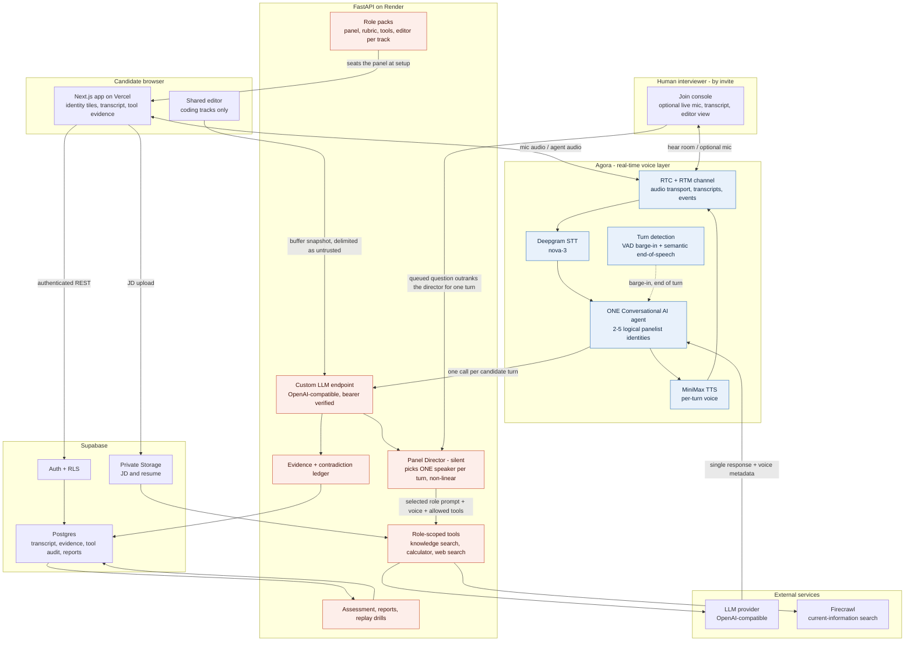

# RoundCraft architecture

## Decision

RoundCraft is a monorepo with two independently deployable applications:

- `apps/web`: Next.js candidate experience on Vercel.
- `apps/api`: one FastAPI modular monolith on Render.

Shared browser contracts and configuration live in `packages/`. Supabase owns product identity and durable data. Agora owns the live voice path. This keeps the latency-sensitive interview loop in Agora without forcing product data, panel logic, or assessment into infrastructure that does not provide those features.

## System map



The critical constraint: **exactly one physical Agora agent** carries two to five *logical*
panelist identities. The Panel Director selects one of them per candidate turn and injects that
role's prompt, voice, and tool allowlist, so the panel is non-linear and interruptible while
Agora only ever renders one audible speaker.

### Text equivalent


```text
Candidate browser
  ├─ HTTPS ───────────────► Next.js on Vercel
  │                           └─ authenticated API calls
  ├─ shared editor ───────► session code buffer (coding tracks only)
  ├─ RTC audio/video ─────► one shared Agora RTC/RTM channel
  └─ RTM events ◄─────────►   ├─ one ConvoAI voice agent
                              ├─ 2-5 logical panel identities
                              ├─ managed STT/TTS, VAD, barge-in, and turn state
                              └─ director-aware custom LLM SSE calls
                                      │
                                      ▼
Human interviewer (by signed invite, optional)
  ├─ RTC audio ────────► the same Agora channel; hears everyone and may
  │                           publish microphone audio when explicitly enabled
  └─ HTTPS ───────────────► guest routes: transcript, editor view, note, or a
                            question the panel asks on the next turn

FastAPI on Render
  ├─ role packs: panel, rubric, tools, and editor per hiring track
  ├─ Panel Director and persona prompts
  ├─ JD/resume ingestion and retrieval
  ├─ role-scoped tools and audit records
  ├─ evidence-linked assessment
  └─ Agora token, webhook, and lifecycle endpoints
      │
      ├─ Supabase Auth, Postgres, pgvector, Realtime, Storage
      ├─ external LLM/embedding provider only where Agora has a gap
      └─ optional web search provider
```

## Live interview flow

1. The candidate searches and picks one of 18 hiring tracks. The role pack for that track seats a default panel, rubric, prompt set, and tools, and declares whether the interview has a coding round. From there they select two to five interviewers from immutable defaults, edit a copy, or create a custom profile.
2. The candidate may upload a JD. The API stores the private original in Supabase Storage, extracts/indexes its text, and uses its role title, company, skills, and focus areas to refine the selected role pack. The selected track remains authoritative, JD recommendations remain editable, and explicit candidate edits outrank both.
3. Starting an interview snapshots the configuration, creates one unguessable channel, issues a short-lived candidate token, allocates the shared publisher plus logical tile identities, and starts exactly one Agora AgentKit session. A failed start is stopped before the product session is marked failed.
4. The browser joins the channel once and renders the logical participant roster. Agora carries candidate audio and the active interviewer output; automatic VAD and barge-in keep the agent listening without client-side speech-boundary choreography.
5. Each candidate turn reaches the custom LLM gateway once. The silent Panel Director applies expertise, evidence-gap, repetition, coverage, and pending-speaker rules, then may select any panelist, including the current one. Sequences such as 1 → 3 → 1 are valid.
6. The selected role's immutable invariants, editable prompt, knowledge, behavior, difficulty, and allowlisted tools are assembled into that turn's system instruction. First-packet metadata selects the role's MiniMax voice while Agora keeps one physical speaking session.
7. Eligible roles may use JD/transcript knowledge search, deterministic calculation, or configured current-information search. Tool inputs and outputs are audited before their bounded context is added to the response.
7b. On a coding track the editor opens automatically when the panel issues a coding task. It shows the exact task and progressive hints, restores the candidate's latest buffer, pushes snapshots to the session as they type, and hands the buffer to the speaking panelist as delimited untrusted context, truncated to 120 lines. The panel reads the buffer; it is never executed.
7c. A human interviewer holding a signed invite may join the same channel and explicitly enable their microphone to speak to the candidate beside the AI panel. Their seat renews the same short-lived Agora UID, sends a ten-second presence heartbeat, and expires from the candidate roster after 30 seconds without one. The Agora agent remains subscribed only to the candidate's UID, preventing the guest's voice from driving AI turn detection. For transcript-linked evidence, the guest submits a question that is stored on the session and consumed by the next turn, where it replaces the director's objective for exactly one turn before the panel resumes its own line.
8. The custom LLM boundary persists every generated interviewer turn with the exact logical panelist selected for it. Agora RTM and signed webhooks then reconcile stable turn IDs, interruption state, and timing into that row instead of guessing attribution from a later UI poll. An optional forced-dispatch endpoint uses `agent_think` for controlled drills without changing the normal automatic-VAD path.
9. On stop, the API leaves the shared agent once, reconciles persisted turns with Agora history, calculates transcript-linked rubric scores, and generates replay drills. Unsupported criteria become `insufficient_evidence`; there is no human-review queue.

## Ownership boundaries

| Capability | Owner |
|---|---|
| Audio transport, STT, TTS, barge-in, live turn/state events | Agora RTC, RTM, Conversational AI |
| Candidate identity and row-level authorization | Supabase Auth and RLS |
| Panel arbitration, prompts, moods, behavior, difficulty | FastAPI |
| JD/resume/company documents and vector retrieval | Supabase Storage, Postgres, pgvector |
| JD/transcript search, calculator, current-information search | FastAPI role-scoped live tools |
| Evidence linking and replay creation | FastAPI assessment pipeline |
| Durable transcript, claims, tool audit, assessment, reports | Supabase Postgres |
| Frontend and product flows | Next.js on Vercel |

## Durable data

| Data | Store | Notes |
|---|---|---|
| Users and sessions | Supabase Auth | JWT verified by API; browser never receives service-role credentials. |
| Prompt templates | Postgres | Built-ins are immutable and versioned; edits create user-owned forks. |
| Interview and panel snapshots | Postgres | Preserves the exact configuration used for a report. |
| Live panel participants | Postgres | Maps logical panelist IDs to the shared runtime agent, reserved media identities, provider/fallback mode, and webhook state. |
| JD, resume, reports, optional media | Private Supabase Storage | Signed URLs and owner-scoped policies only. |
| Extracted document chunks | Postgres + pgvector | Uploaded text is untrusted content, never system instructions. |
| Transcript turns | Postgres | Keyed by interview and Agora `turn_id`, including interrupted status. |
| Candidate editor and co-host state | Postgres, inside the session's live state | The buffer, heartbeat-bounded human presence and stable RTC UID, notes, and any question queued for the panel. Bounded and replaced per turn, not an append-only log. |
| Tools and evidence | Postgres | Every scored item links to transcript and optionally tool evidence. |
| Agora webhooks | Postgres | HMAC verified and idempotent by notice ID. |

## Security boundary

- Browser-visible configuration is limited to `NEXT_PUBLIC_API_BASE_URL`, `NEXT_PUBLIC_AGORA_APP_ID`, `NEXT_PUBLIC_DEMO_MODE`, `NEXT_PUBLIC_SUPABASE_URL`, and the RLS-constrained `NEXT_PUBLIC_SUPABASE_PUBLISHABLE_KEY`. The legacy anon variable remains accepted during migration. `AGENT_BACKEND_URL` is server/build-only. App certificates, Supabase secret keys, provider keys, webhook secrets, and database URLs remain server-side.
- The custom LLM endpoint verifies `AGORA_LLM_BEARER_SECRET`, a dedicated credential distinct from webhook HMAC and Agora project credentials. Webhooks verify the signature over the raw body and deduplicate retries.
- RLS protects candidate-owned rows and Storage objects; API access does not replace database policies.
- JD/resume contents are not sent to web search. Retrieved text is delimited as data and cannot change system instructions or tool permissions.
- Tools use strict schemas, role allowlists, timeouts, output limits, and audit rows. Calculations are deterministic and never use `eval`.
- Human-interviewer invites are bearer credentials and are scoped accordingly: one session, a six-hour expiry, HMAC-SHA256 over the claims, and a signing key derived from the deployment secret under a fixed domain label so it cannot verify anything else. Guest routes are separate from owner routes and can only read the session they name, never enumerate or mutate it.
- The candidate's editor is untrusted candidate input. It is delimited before it reaches the model, capped in length, and rendered to the panel as text — it is never executed, and on the guest's screen it is rendered as React elements rather than HTML.
- Render is public only at the network layer because Agora needs HTTPS callbacks. Product endpoints still require JWTs or service-specific credentials.

## Scale and failure behavior

Render deploys only after CI passes and routes a new instance after `/health/ready` succeeds. Production uses an always-on plan; region, plan, and instance count remain controlled by the existing Render service. One FastAPI service is intentional: the interview director, tool registry, and assessment share one transactional model and do not need separate services yet. Forced dispatch and interruption have stateless Agora fallbacks, so correctness does not depend on a request reaching the instance that started the agent. Each live interview consumes one Agora Agent session and, only when configured, one external avatar-vendor session for the active speaker; all logical panelists have animated identity-tile fallbacks. Agora REST history is not treated as durable memory; transcript events are persisted continuously and reconciled after stop. If assessment fails, its idempotent report operation can retry without restarting the Agora session.
